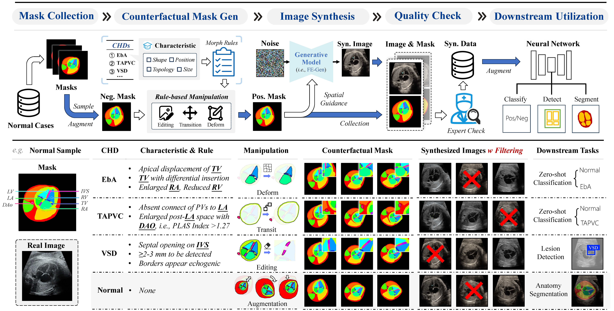

<h1 align="center">
     Pos4CHD: A Positive-Free Mask-Guided Counterfactual Synthesis Framework for Fetal Congenital Heart Defect Analysis
</h1></h1> 

> Wenjie Xuan et al. Submitted to TMI. 

This is the official implementation for the paper "*Pos4CHD: A Positive-Free Mask-Guided Counterfactual Synthesis Framework for Fetal Congenital Heart Defect Analysis*". We propose Pos4CHD, a positive-free mask-guided counterfactual generation framework for fetal echocardiography, to alleviate CHD data scarcity. We first introduce FE-Gen for ultrasound generation, which mitigates histogram shift via regularization and improves spatial image-mask alignments via learnable semantic queries. Based on FE-Gen, Pos4CHD transforms normal masks into counterfactual ones and generates corresponding images, yielding pseudo-CHD image-mask pairs for downstream analysis.  Please refer to our paper for more details.

## :fire: News

- **[2026/10/06]**:  Start the github project. We are preparing codes and models, and will release them in a few days. 

## :round_pushpin: Todo

- [ ] Further curations of the code. 
- [ ] Release the checkpoints of downstream models for CHD analysis. 
- [ ] Release the checkpoints of our FE-Gen.  
- [ ] Release the code for downstream tasks, including classification, detection, and segmentation.  
- [ ] Release the code for generative model training, inference, and visualization. 
- [ ] Release the code for preparing datasets and demos. 

## :sparkles: Highlight

- **A positive-free mask-to-image counterfactual generation framework**, namely Pos4CHD, to tackle the scarcity of fetal CHD cases, especially rare subtypes, which offers pseudo-positive image-mask pairs for diverse CHDs through rule-based counterfactual mask manipulation and mask-guided fetal ultrasound synthesis.
- **A mask-guided generative model for fetal echocardiography**, namely FE-Gen, realizing improved ultrasound fidelity and advanced image-mask alignment, which is trained on a collect normal fetal 4CH-view datasets with 14 anatomical annotations.
- **Promising results on versatile downstream real-world CHD analysis tasks. ** Experiments together with expert evaluations and detailed ablations demonstrate the effectiveness of our synthesized samples for data augmentation across various downstream tasks, bringing consistent improvements on zero-shot CHD classification, lesion detection, and fetal heart anatomy segmentation. 